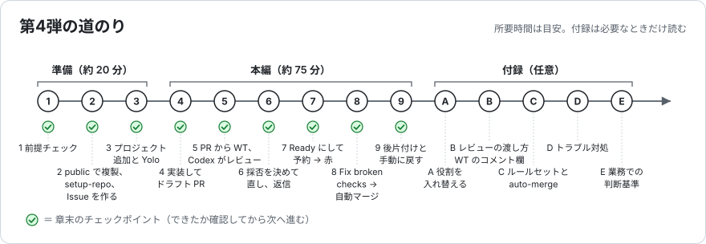
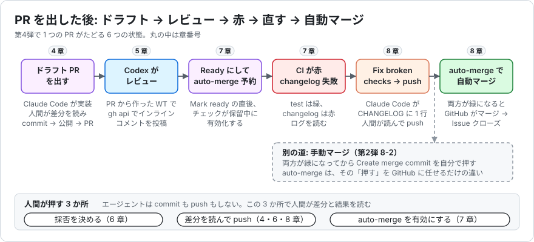
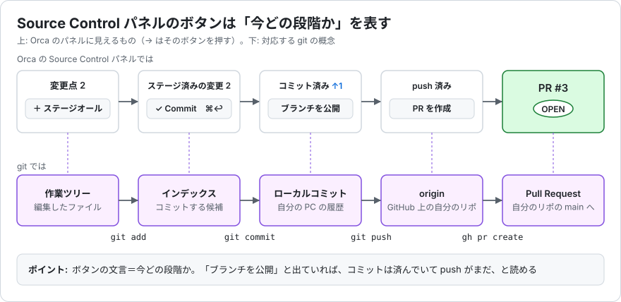
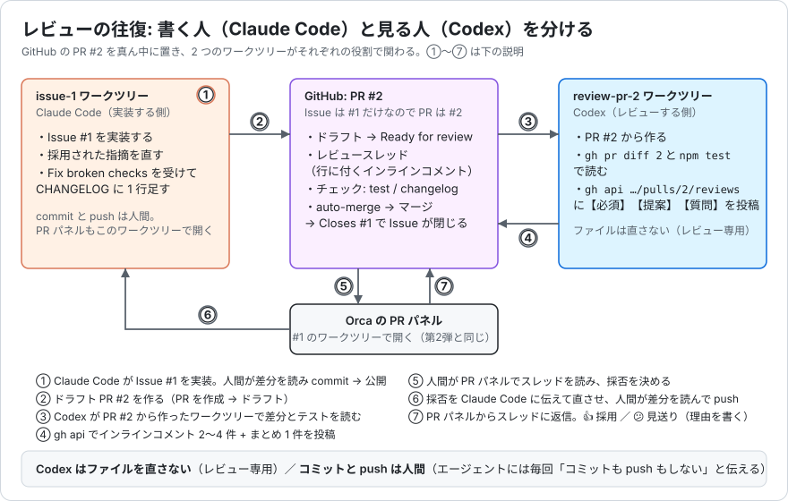
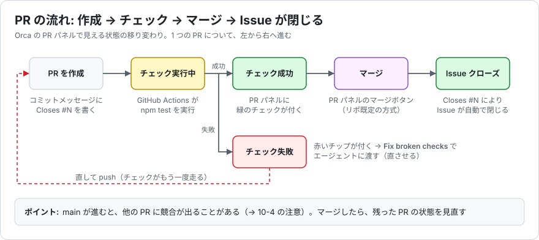

# Orca ハンズオン 第4弾 — PR を出した後: レビューコメントと CI の赤に応えて、自動マージまで

所要時間の目安: 約 100 分（エージェントと GitHub Actions の待ち時間を含む）
確認環境: macOS（Apple Silicon）、Orca 1.4.201（日本語 UI）、Claude Code 2.1.x、Codex CLI 0.15x、gh 2.8x、Node.js 22

[第1弾](https://github.com/misshii3/orca-handson)、[第2弾](https://github.com/misshii3/orca-handson-2)、[第3弾](https://github.com/misshii3/orca-handson-3) を終えている前提で書いています。ワークツリーの作り方（第3弾 4-1）、差分の読み方、コミット → 公開 → PR → チェック → マージの 5 手（第3弾 9-2）、`Closes #N`（第2弾 6-2）は該当章を示すだけにします。第4弾で初めて出てくる操作（ドラフト PR、PR からのワークツリー、レビュースレッドへの返信とリアクション、auto-merge、Fix broken checks）だけを丁寧に書きます。

Orca は更新が速く、ボタンの文言や配置が変わることがあります。画面と食い違ったら、主要な用語に（ ）で併記した英語ドキュメントの呼び方を手がかりに [公式ドキュメント](https://www.onorca.dev/docs) を探してください。

> **この版は実機通し前の初版です。**（要確認）の付いた UI 表記とスクリーンショットは次回の検証で確定します。
>
> **スクリーンショットについて**: 画像は検証用に `orca-handson-4-test` という名前で複製したリポジトリで撮影する予定です。あなたの画面では `orca-handson-4` と読み替えてください。
>
> **キー表記**: ⌘ = command、⇧ = shift、⌥ = option、↩ = Enter（return）、⌫ = delete

---

## 0. このハンズオンのゴール

終わったときに、次のことが一人でできるようになっているのがゴールです。

- PR を **ドラフト** で出し、レビューが済んでから **Ready for review** にできる
- 別のワークツリーで **エージェントに PR をレビューさせ**、GitHub に **インラインコメント** として投稿させられる
- Orca の PR パネルで **レビュースレッドを読み、採否を自分で決め**、採ったものだけをエージェントに直させ、**返信とリアクション** で結果を返せる
- **必須チェックと auto-merge** の関係を理解し、保留中に予約した auto-merge が、チェックが通った瞬間に PR をマージするのを見届けられる
- **CI の赤** を PR パネルのログで読み、**Fix broken checks** でエージェントに渡して直させ、何が送られたかを説明できる
- 「PR を出した後」に人間が押すボタンが **どこに残るか**（採否、auto-merge の予約、push）を説明できる

### 全体の流れ



章ごとの「どこで・何をするか」は次のとおりです。今どこにいるか分からなくなったら、ここに戻ってください。

| 章 | どこで作業するか | やること | 目安 |
|---|---|---|---|
| 1〜3 | ターミナルと Orca の設定 | ツールの確認、テンプレートから **public で** 複製、`setup-repo.sh` でルールセットと auto-merge を設定、Issue #1 を作成、Orca にプロジェクトを追加して Yolo に切り替え | 20 分 |
| 4 | #1 のワークツリー（Claude Code） | Issue #1 からワークツリーを作り、実装させ、差分を読んで `Closes #1` でコミット、公開、**ドラフト PR #2** を作る | 15 分 |
| 5 | #2 のワークツリー（Codex、**PR から作る**） | PR #2 からワークツリーを作り、Codex にレビューさせて GitHub に **インラインコメント** を投稿させる | 15 分 |
| 6 | #1 の PR パネルと Claude Code | レビュースレッドを読み、採否を決め、採ったものだけ Claude Code に直させ、差分を読んで push、各スレッドに **返信とリアクション** | 15 分 |
| 7 | #1 の PR パネル | **Ready for review** → すぐ **Enable auto-merge**（予約）→ `test` 緑・`changelog` **赤** → ログを読む → CONTRIBUTING を初めて開く | 15 分 |
| 8 | #1 の PR パネルと Claude Code | **Fix broken checks** → 届いたものを見る → CHANGELOG の 1 行を読んで push → 何も押さずに待つ → **PR が自分でマージ** → Issue #1 クローズ → ブランチ自動削除 | 15 分 |
| 9 | プライマリ | ワークツリー 2 本の削除、Yolo を手動に戻す、pull して `npm test`、Issue とルールセットの確認 | 5 分 |

本編で体験するのは、**PR を出してから main に入るまで** の往復です。**エージェントがレビューを書く → あなたが採否を決める → エージェントが直す → あなたが読んで push する → CI が守る → 予約した auto-merge が入れる。** 人間が押すのは「採否」「auto-merge の予約」「push」の 3 か所だけです。



### 第1弾〜第3弾との違い

| | 第1弾 | 第2弾 | 第3弾 | 第4弾 |
|---|---|---|---|---|
| タスク | 同じバグ修正を Claude Code と Codex で競争 | 別々の機能追加を 3 本並列 | 見た目の崩れ 4 か所（Claude Code）とクーポン入力欄（Codex）を 2 本並列 | **1 本の PR を、実装（Claude Code）とレビュー（Codex）で分担**。CI の赤と auto-merge まで |
| エージェントへの指示 | 指示文を貼る | Issue の URL が入力欄に入っている | ブラウザで要素をクリックし、メモを付けて送る | **レビューコメントを採否して渡す**、**Fix broken checks** で CI の失敗を渡す |
| 確認の仕方 | `npm test` と差分 | テスト・差分・PR のチェック | ブラウザで見た目を確認 + 差分 | **レビュースレッド・CI のログ・差分** の 3 つを PR パネルで読む |
| 権限 | 手動 | Yolo | Yolo | Yolo（同じ 4 条件。9 章で手動に戻す） |
| ゴール | PR を作るまで | マージ → コンフリクト解消 → Issue クローズ | 画面が直った状態で 2 本ともマージ | **必須チェックが通った瞬間に auto-merge で入る** → Issue クローズ → ブランチ自動削除 |

### 用語（先に押さえておく）

| 用語 | 意味 |
|---|---|
| ドラフト PR（Draft pull request） | 「まだマージしないでほしい」印の付いた PR。マージボタンが出ず、レビューは受けられます。**Ready for review**（レビュー準備完了）に切り替えると普通の PR になります。GitHub Free では **public リポジトリだけ** で使えます（2-1 で public にする理由の 1 つ） |
| レビューコメント / レビュースレッド（Review thread） | PR の差分の **特定の行** に付くコメント（インラインコメント）と、そこから続く返信の束。PR 全体へのコメント（会話）とは別物です。5 章で Codex が付け、6 章であなたが読みます |
| リアクション（Reaction） | コメントに付ける絵文字（GitHub の 8 種: 👍 👎 😄 🎉 😕 ❤️ 🚀 👀）。返信を書かずに「読んだ・採用した」を伝えます。本書では 👍 = 採用、😕 = 見送り（理由は返信に書く） |
| ルールセット（Ruleset） | GitHub 側で「`main` に入れる条件」を決める仕組み。2 章の `setup-repo.sh` が `main-required-checks` という名前で「**必須チェック `test` と `changelog` が通っていること**」（+ ブランチ削除と force push の禁止）を作ります。GitHub Free では public リポジトリだけで使えます |
| 必須チェック（Required status check） | ルールセットで「通っていないとマージできない」と決めたチェック名。名前は GitHub Actions の **ジョブ名**（`test`、`changelog`）と一致していないと効きません |
| auto-merge（自動マージ） | 「条件がそろったら GitHub が勝手にマージしてよい」と PR ごとに **予約** する機能。**必須チェックが保留中（実行中）のときだけ** 予約できます。すべて成功している PR は普通のマージボタンが出るだけで、必須チェックが **失敗している間も押せません**。7 章で予約し、8 章で発動を見ます |
| Fix broken checks | PR パネルの赤いチェックの近くに出る Orca の機能。**失敗したチェック名とログへのリンク** をエージェントに渡して直させます。8 章。届く中身は 8-2 で見ます |
| CHANGELOG.md | 変更履歴。このリポジトリでは「`## 未リリース` の下に、PR ごとに 1 行、行末に **Issue 番号** を `(#1)` の形で付けて足す」ルールです（何が足りないかは 7 章で CI が教えてくれます） |
| CONTRIBUTING.md | 「このリポジトリに PR を出すときのルール」を書いたファイル。このリポジトリでは `docs/CONTRIBUTING.md` にあります（GitHub はルート・`docs/`・`.github/` のどこにあっても認識します）。7 章で読みます |
| ブランチの自動削除（Automatically delete head branches） | マージされた PR のブランチをリモートから自動で消すリポジトリ設定。`setup-repo.sh` が有効にします。8 章の最後に確認 |
| PR パネル / ソース管理 | 第2弾と同じ。右パネル上部の 3 番目（ソース管理 ⌘⇧G）と 4 番目（チェック）のアイコン |

Issue と PR は **番号を共有** します。今回は Issue が **#1 だけ** なので、PR は **#2** になります。本書は PR を #2 と書きます。番号が違ったら読み替えてください。

### つまずきやすいところ（先に 3 つだけ）

本編でよく起きる迷い方です。どれも付録 D に直し方がありますが、先に知っておくと避けられます。

1. **複製は `--public`**（2-1）。private で `setup-repo.sh` を打つとルールセットが作れず、7〜8 章（必須チェック、auto-merge）が成り立ちません。エラー文にそのまま直し方が出ます
2. **push と auto-merge は、あなたが押す**。エージェントには毎回「コミットも push もしない」と言い、差分を読んでから push します（4-3、6-3、8-3）。7-2 で auto-merge を予約した後は、**push した瞬間に `main` に入る道が開いています**。8-1 で Claude Code にもう一度「push しない」と言うのはこのためです
3. **2 本目のワークツリー（Codex）はレビュー専用**。ファイルは直させません。直すのは #1 の Claude Code だけです。同じ PR を 2 か所から直すと、push が競合します（5-2）

---

## 1. 前提チェック（5 分）

第1〜3弾の準備の章が済んでいる（Orca がインストール済みで、「連携」の GitHub が Connected、Issue からワークツリーを作った経験がある）ことを前提にします。ターミナルで次を確認してください。

```bash
claude --version      # 2.x
codex --version       # codex-cli 0.15x
node --version        # v20 以上
gh auth status        # "Logged in to github.com account <あなたのID>" が出れば OK。Token scopes に repo が含まれていること
```

`gh auth status` の `Token scopes` に `repo` が無いときは `gh auth refresh -s repo` で足しておきます（2-2 のルールセット作成に必要です）。

Orca も起動しておきます。バージョンは、メニューバーの **Orca → Orca について**（About Orca）で確認できます。1.4.201 前後なら本書の表記と合うはずです。

✅ **ここまでできたら**: 4 つのコマンドが全部エラーなく終わり、Orca が起動している。

---

## 2. サンプルリポジトリを public で複製して、ルールを入れ、Issue を作る（10 分）

### 2-1. テンプレートから public で複製する

```bash
cd ~/Documents
gh repo create orca-handson-4 --template misshii3/orca-handson-4 --public --clone
cd orca-handson-4
npm test
```

`npm test` は **30 件すべて成功** します（第3弾の完成状態 26 件 + 今回足したチェックスクリプトのテスト 4 件）。

```
ℹ tests 30
ℹ suites 10
ℹ pass 30
ℹ fail 0
```

このリポジトリは、第3弾の 2 本の PR（見た目の崩れ 4 か所の修正と、クーポン入力欄）がマージされた状態から始まります。`npm run dev` で完成した注文確認ページを見ておいても構いません（見たら `Ctrl+C`。第4弾では dev サーバーは使いません）。

> **なぜ public か**: 第1〜3弾は `--private` でした。第4弾で使う **ドラフト PR** と **ルールセット（必須チェック）** は、GitHub Free では public リポジトリでしか使えません。必須チェックが無いと **Enable auto-merge** も出ません（すぐマージできる PR には表示されない仕様です）。練習用に複製したばかりで秘密の情報はないので public にします。有料プラン（Pro / Team）なら private でも同じことができます。詳細は付録 C。

> **`--private` で作ってしまったら**: `gh repo edit --visibility public --accept-visibility-change-consequences` で切り替えてから 2-2 へ進みます。

### 2-2. リポジトリにルールを入れる（`setup-repo.sh`）

```bash
bash scripts/setup-repo.sh
```

```
対象リポジトリ: <あなたのID>/orca-handson-4（PUBLIC）

1/3 自動マージと、マージ後のブランチ自動削除を有効にします
  完了

2/3 main の ruleset「main-required-checks」を作ります
  作成しました

3/3 設定の確認
  自動マージ: true   マージ後にブランチ削除: true
（続いて gh ruleset check main の出力。main-required-checks の 3 つのルールが並びます。要確認: 出力の形）
```

やったことは 3 つです。

1. **自動マージ（auto-merge）を許可**した。PR ごとの予約は 7 章で押します
2. **マージ後にブランチを自動削除**する設定にした。8 章の最後に確認します
3. `main` に **ルールセット `main-required-checks`** を作った。必須チェックは `test` と `changelog`（`.github/workflows/ci.yml` のジョブ名）。あわせて `main` の削除と force push を禁止しています

もう一度実行しても増えません（`2/3` が「すでにあります（id: …）」になります）。

> **`{owner}/{repo}` はそのまま打ちます**: 本書の `gh api` の例に出てくる `repos/{owner}/{repo}/...` は、`gh` が今いるリポジトリの名前に置き換えてくれる書き方です。6 章で Claude Code にも同じ書き方で頼みます。

### 2-3. タスク用の Issue を 1 件作る

```bash
bash scripts/seed-issues.sh
```

```
対象リポジトリ: <あなたのID>/orca-handson-4

作成しました: 送料無料までの残額を注文確認ページに表示する（「あと 30 円で送料無料になります」）
  https://github.com/<あなたのID>/orca-handson-4/issues/1

現在の Issue:
（gh issue list の出力。#1 が 1 件）
```

今回の Issue は 1 件だけです（付録 A で 2 件目を作ります）。

### 2-4. Issue を読む

```bash
gh issue view 1
```

内容は「送料無料まであといくらか」を注文確認ページに出す、小さな機能追加です。

- `src/price.js` の `calcShipping` の直後に、純粋関数 `remainingForFreeShipping(total)` を足す。既存の定数 `FREE_SHIPPING_THRESHOLD` を使う
- `test/price.test.js` に 4 例（0 → 3000、2970 → 30、3000 → 0、8000 → 0）のテストを足す
- `public/index.html` の `<!-- Issue #1: 送料無料までの残額の表示はここに追加する -->` の位置に `<p class="shipping-hint" id="shipping-hint" hidden></p>` を足し、`public/app.js` の `renderSummary` で「あと 30 円で送料無料になります」を表示する。残額 0 円なら非表示
- 具体例: `WELCOME10`（初期状態）→ あと 30 円、`SAVE500` → あと 200 円、`ABC`（無効）→ 非表示

受け入れ条件には、`npm test` が **30 → 34 件**、変更するファイルは **5 つだけ**、dev サーバーを触らない、**コミット・push・PR 作成はしない**（参加者が Orca から行う）、日本語で報告する、とあります。機能はわざと小さくしてあります。第4弾の主役は **PR を出した後の往復** だからです。

✅ **ここまでできたら**: `npm test` が 30 件成功、`gh repo view --json visibility` が `PUBLIC`、`gh ruleset check main` に `main-required-checks` が出る、`gh issue list` に #1 だけが出ている。

---

## 3. Orca にプロジェクトを追加して、Yolo に切り替える（5 分）

### 3-1. プロジェクトを追加する

第3弾 3-1 と同じです。サイドバーの「プロジェクト」右の **+**（プロジェクトを追加）から `~/Documents/orca-handson-4` を選びます。サイドバーに `orca-handson-4` と `main ［プライマリ］` が出ます。「**セットアップスクリプトを追加する**」のポップアップは **×** で閉じて構いません（依存パッケージはありません）。

### 3-2. 「Agent の権限」を Yolo にする

第3弾 3-2 と同じく、練習リポなので Yolo を使います。理由と条件は第2弾の付録 C にまとめてあります。第4弾でも同じ 4 条件がそろっているか、いま一度確認してください。

- [ ] リポジトリが使い捨てで、認証情報や個人情報が含まれていない（複製したばかりの `orca-handson-4`。public です）
- [ ] エージェントが取り消せない操作をしても困らない
- [ ] 社内コードやプロンプトを外部 LLM に送ることが組織のルールで許されている
- [ ] 出てきた差分を全部読む時間がある（4-2、6-3、8-3）

**設定（⌘,）→ Agent → 「Agent の権限」を「Yolo」** にします。「インストール済み」の欄で、Claude の起動コマンドに `--dangerously-skip-permissions`、Codex に `--dangerously-bypass-approvals-and-sandbox` が付いたことを確認します。

> **9 章で必ず手動に戻します。** 業務のリポジトリで Yolo のまま作業しないようにするための習慣です。

✅ **ここまでできたら**: サイドバーに `orca-handson-4` があり、「Agent の権限」が Yolo になっている。

---

## 4. Issue #1 から実装して、ドラフト PR を出す（15 分）

> 4〜8 章が本編です。4 章は第3弾 4-1 と 9-2 の復習に、**ドラフト** が 1 つ加わるだけです。

### 4-1. #1 のワークツリー（Claude Code）

サイドバーで `orca-handson-4` を選んで **⌘N**。第3弾 4-1 と同じダイアログです。

| 項目 | 入れる値 |
|---|---|
| プロジェクト | `orca-handson-4` になっているか確認 |
| 実行先 | `Local Mac` のまま |
| タブ | 「**GitHub**」に切り替える |
| 選ぶ Issue | **#1 送料無料までの残額を注文確認ページに表示する** |
| Agent | **Claude** |

「詳細設定」の名前欄は空のままで構いません。Orca は `issue-1` という名前（ブランチは `<あなたのID>/issue-1`）を付けます。「**ワークツリーを作成する ⌘↩**」を押すと Claude Code が起動し、初回は「Quick safety check」（**Yes, I trust this folder**）が出ます。

入力欄に Issue の URL が入っています。その **後ろに** 次の一文を足して ↩。

```
この Issue を読んで実装してください。npm test が通ったら、コミットも push もせずに、何をどう実装したか日本語で報告してください。差分は私が読んでコミットします。
```

参考値: **2〜4 分**。待っている間に次を読んでください。

> **この後の合言葉**: 第4弾では、エージェントへの指示の最後に毎回「コミットも push もしない」を付けます。理由は 7 章で分かります。auto-merge を予約した PR では、**push した瞬間に `main` に入る道が開く** からです。第2弾・第3弾でも人間がコミットしてきましたが、今回はそれが最後の関門になります。

<!-- 📷 images/01_claude_report_shipping_hint.png: Claude Code の実装報告（関数名、テスト 4 件、表示の場所、コミットしていないと書いてある） -->

### 4-2. 差分を読む

右パネルの **ソース管理（⌘⇧G）** → Changes に 5 ファイルが出ています。クリックして差分を読みます。

- [ ] `src/price.js`: 既存の定数はそのまま。`remainingForFreeShipping` が **`calcShipping` の直後に 1 つ** 増えただけ。`FREE_SHIPPING_THRESHOLD` を使い、`3000` をそのまま書いていない。JSDoc が日本語
- [ ] `test/price.test.js`: Issue の 4 例（0 → 3000、2970 → 30、**ちょうど 3,000 → 0**、8000 → 0）がある
- [ ] `public/index.html`: マーカーコメントの位置に `<p class="shipping-hint" id="shipping-hint" hidden>` が 1 つ増えただけ
- [ ] `public/app.js`: `renderSummary` に表示の数行が足され、既存の関数の振る舞いが変わっていない。金額に既存の `yen()` を使い、0 円のときは空にして `hidden`
- [ ] `public/style.css`: 追加は末尾の `.shipping-hint` だけ
- [ ] 上の 5 ファイル以外に「ついで」の修正がない

<!-- 📷 images/02_changes_shipping_hint_diff.png: Changes に 5 ファイル、src/price.js の差分に関数が 1 つ -->

タブバーの **+ → 新規ターミナル ⌘T** で `npm test`。**30 → 34 件** になっています。 画面でも見たければ、同じターミナルで `npm run dev` → 普段のブラウザで `http://localhost:3000` を開くと「あと 30 円で送料無料になります」が出ています（見たら `Ctrl+C`。以降は使いません）。

### 4-3. コミット → 公開 → ドラフト PR

第3弾 9-2 の 5 手のうち、前半 3 手です。

1. 「**ステージオール**」→ コミットメッセージ欄の AI アイコンで文面を作らせ、読んで直し、末尾に **`Closes #1`** を足して「**Commit**」（第2弾 6-2）
2. 「**ブランチを公開**」
3. 「**PR を作成**」。**第4弾で新しいのはここ** です。1.4.201 では PR の内容を確認するダイアログが開きます（要確認: 第2弾・第3弾の 1.4.200 ではダイアログなしで作成されました。出なければ付録 D の `gh pr create --draft --fill` に差し替えます）

| 項目（要確認: 日本語表記） | 入れる値 |
|---|---|
| ベースブランチ（Base） | `main` のまま |
| タイトル（Title） | `送料無料までの残額を表示する` |
| 説明（Description） | 「AI で生成」（要確認。英語ドキュメント: Generate pull request details with AI）を押して読み、末尾に `Closes #1` が無ければ足す |
| **ドラフト**（Draft）（要確認: トグルの表記） | **オン** |

<!-- 📷 images/03_pr_create_dialog_draft_toggle.png: PR 作成ダイアログ。ベースブランチ、タイトル、説明、ドラフトのトグルがオン -->

4. 作成すると右パネルが PR パネルに切り替わり、**#2** と **DRAFT**（要確認: バッジの表記）が出ます。**マージボタンが出ない** ことを確認してください（ドラフトの印）。チェックの欄は `test` が Queued → Successful になり（参考値 1 分）、`changelog` は **Skipped**（要確認: Orca での表記）と出ます

> **ドラフトのうちは `changelog` のチェックは走らない設定にしてあります**（`.github/workflows/ci.yml` の `if`）。`test` は走ります。「コードのテストはいつでも、マージ直前のルールは Ready になってから」という、このリポジトリの流儀です。GitHub の既定ではドラフトでもすべて走ります。7 章で Ready にした瞬間に `changelog` が走ります。

<!-- 📷 images/04_pr_panel_draft.png: PR パネル。#2 DRAFT、マージボタンなし、test 緑・changelog Skipped -->



✅ **ここまでできたら**: PR #2 が **DRAFT** で OPEN、コミットメッセージに `Closes #1`、PR パネルにマージボタンが出ておらず、`test` が緑。

---

## 5. PR から 2 本目のワークツリーを作り、Codex にレビューさせる（15 分）

### 5-1. PR からワークツリーを作る

サイドバーで `orca-handson-4` を選んで **⌘N** → タブ「**GitHub**」。今回は Issue ではなく **Pull Request の一覧**（要確認: Issue と PR の切り替え方法と表記。出ないときはダイアログを閉じて開き直す）から **#2 送料無料までの残額を表示する** を選び、Agent を **Codex** にします。「詳細設定」の名前欄に **`review-pr-2`** と入れます（PR から作ると PR のタイトルから名前が付き、`issue-1` と見分けにくいためです）。ブランチ名の欄は出ません。PR に紐づくブランチを Orca が解決します。

<!-- 📷 images/05_create_dialog_github_tab_pr_list.png: 作成ダイアログの GitHub タブに PR #2、Agent = Codex、名前 review-pr-2 -->

> **要確認（実機通しの最重要項目）**: #1 のワークツリーが `<あなたのID>/issue-1` を checkout 済みなので、git は同じブランチを 2 か所で checkout できません。Orca が (a) 別名のブランチを切る、(b) detached HEAD で開く、(c) エラーになる、のどれになるかを確認します。(c) なら、「名前」タブで `main` から `review-pr-2` を作り、Codex に PR の URL を渡す手順に差し替えます。下のレビュアープロンプトの 1 行目が `pull/2/head` を取り出すので、どの状態でもレビューは成り立ちます。

Codex の入力欄（`»`）に PR の URL が入っています（要確認）。その後ろに、リポジトリの `docs/review-prompt.md` の `---` より下を **そのまま** 貼って ↩。全文は次のとおりです。

````
あなたは PR #2 のレビュアーです。このワークツリーは PR #2 のブランチを開いています。コードは一切変更せず、レビューコメントを GitHub に投稿するところまでを行ってください。

## 準備
1. `gh pr view 2 --json title,headRefName,headRefOid,body` で PR の情報を取り、`git rev-parse HEAD` が headRefOid と一致することを確認する。違っていたら `git fetch origin pull/2/head && git checkout --detach FETCH_HEAD` で PR の先頭を取り出す
2. `gh issue view 1` で仕様（Issue #1）を読む
3. `gh pr diff 2` で差分を読み、必要なら変更されたファイル全体も読む
4. `npm test` を実行して結果を確認する（dev サーバーは起動しない）

## レビューの観点（この 5 つに限定する）
- 仕様との一致: Issue #1 の表（テスト 4 例・画面 3 例）どおりに動くか
- エッジケース: 境界値（2,999 円 / 3,000 円）、0 円、クーポンを付け替えたときに表示が更新されるか
- 既存の関数・定数の再利用: `FREE_SHIPPING_THRESHOLD`、`calcShipping`、`yen()` を使っているか。同じ計算を 2 か所に書いていないか
- アクセシビリティ: 文字が動的に変わる要素の扱い（`role="status"` や `aria-live`）、非表示の仕方
- テスト: 4 例で十分か。足すべき境界値はないか

CHANGELOG やドキュメント、リリース手順については指摘しない。コードとテストだけを見る。

## 出力（GitHub に投稿する）
- 行に対する（インライン）コメントを 2〜4 件と、全体のまとめコメントを 1 件。すべて日本語
- 各インラインコメントは「【必須】/【提案】/【質問】のラベル → 指摘 → 理由 → 提案（あれば修正例）」の順で 3〜6 行。【必須】は直さないとバグや仕様違反になるもの、【提案】は好みや読みやすさで採否が作者の判断になるもの、【質問】は意図を確認したいもの。少なくとも 1 件は【提案】にする
- 投稿は次の 1 回の API 呼び出しで行う。`event` は必ず `COMMENT`（自分の PR には APPROVE / REQUEST_CHANGES はできない）
- `line` は `gh pr diff 2` に出てくる **変更後のファイルの行番号**（`+` の行、またはその変更ブロックの中の行）。`side` は `RIGHT`。差分に含まれない行にはコメントできない（422 エラーになる）
- JSON はリポジトリの外（`/tmp/review.json`）に書く。リポジトリにファイルを増やさない

```bash
cat > /tmp/review.json <<'JSON'
{
  "event": "COMMENT",
  "body": "（まとめ: 良い点を 1〜2 行、直してほしい点の要約、npm test の結果）",
  "comments": [
    { "path": "public/app.js", "line": 63, "side": "RIGHT", "body": "【提案】…\n理由: …\n提案: …" },
    { "path": "src/price.js", "line": 80, "side": "RIGHT", "body": "【質問】…" }
  ]
}
JSON
gh api -X POST repos/{owner}/{repo}/pulls/2/reviews --input /tmp/review.json --jq '.html_url'
```

## やってはいけないこと
- ファイルの変更、コミット、push、`gh pr review --approve` / `--request-changes`
- dev サーバーの起動

## 最後に
投稿した URL と、コメントの要約（1 件 1 行）を日本語で報告してください。422 エラーで投稿できなかったときは原因（行番号が差分にない、など）を直して再送し、それでも無理なら JSON の内容をそのままターミナルに出力してください。
````

参考値: **3〜6 分**。Codex が `gh pr diff` で差分を読み、`npm test` を回し、JSON を組んで `gh api` で投稿します。

### 5-2. なぜ「レビュー専用」なのか

> **Codex には直させません**（つまずき 3）。Codex が直すと、#1 の Claude Code と同じ PR を 2 か所から書き換えることになり、push が競合します。レビュアーは **読む・コメントを書く** だけ。業務でも「レビュアーが勝手にコミットしない」のと同じです。直すのは 6 章で、#1 のワークツリーの Claude Code です。



### 5-3. 投稿されたことを確かめる

Codex の報告を読みます。投稿した URL と、コメントの一覧（ファイル・行・要旨）が出ているはずです。

<!-- 📷 images/06_codex_review_posted_report.png: Codex の報告（投稿した URL とコメント 3 件の一覧） -->

ターミナル（プライマリでも #2 のワークツリーでも可）で GitHub 側を確認します。

```bash
gh api repos/{owner}/{repo}/pulls/2/comments --jq '.[] | "\(.path):\(.line)  \(.body | split("\n")[0])"'
```

```
src/price.js:82  【必須】ちょうど 3,000 円のとき…（例）
public/app.js:64  【提案】…
test/price.test.js:90  【質問】…
```

2〜4 行出れば OK です。普段のブラウザで PR #2 の **Files changed** を開くと、差分の行にコメントが付いています。

<!-- 📷 images/07_github_files_changed_inline_comments.png: GitHub の Files changed。差分の行に【提案】のコメント（任意） -->

> **Codex が「差分に無い行」を指定して 422 になったら**: プロンプトに書いてあるので Codex が自分でやり直します。それでも投稿できないときは付録 D（`gh pr review 2 --comment --body "…"` で PR 全体へのコメントに切り替える）。

✅ **ここまでできたら**: PR #2 に Codex のレビューコメントが 2〜4 件付き、それぞれ【必須】【提案】【質問】のどれかで始まっている。Codex のワークツリーの Changes は **空**。

---

## 6. レビューを読み、採否を決め、Claude Code に直させ、返事を返す（15 分）

### 6-1. PR パネルでレビュースレッドを読む

サイドバーで `issue-1` を選び、右パネル 4 番目（チェック）→ PR 番号右の **更新アイコン**。「レビュー」（要確認: セクション名。英語ドキュメント: review threads）に Codex のまとめコメントと、ファイル名・行番号付きのスレッドが並びます（新しいものが上）。スレッドをクリックすると該当の差分行に飛びます（要確認）。

<!-- 📷 images/08_pr_panel_review_threads.png: PR パネルのレビュー欄。3 スレッド、【必須】【提案】【質問】 -->

### 6-2. 採否を決める（あなたの仕事）

| 種類 | 決め方 | 返し方（6-4） |
|---|---|---|
| 【必須】 | 原則採用。Issue と照らして本当に必須か確認する | 直して 👍 +「対応しました」 |
| 【提案】 | **採否はあなたが決める**。Issue の範囲を超える、好みの問題、今回は見送る、など理由を言えるなら見送ってよい | 採用なら 👍、見送りなら 😕 + 理由を返信 |
| 【質問】 | コードは変えない。意図を返信で答える | 返信のみ |

> **全部受け入れない**: レビューは提案であって命令ではありません（エージェントのレビューは特に）。見送るときは理由を書きます。これが付録 E の 1 つ目です。

### 6-3. 採ったものだけ Claude Code に直させる

`issue-1` の Claude Code のタブで、次を埋めて送ります。`<…>` はあなたの採否で書き換えてください。

```
PR #2 にレビューコメントが付きました。次の 2 つで全部読んでください。
  gh api repos/{owner}/{repo}/pulls/2/reviews --jq '.[] | {user: .user.login, state, body}'
  gh api repos/{owner}/{repo}/pulls/2/comments --jq '.[] | {id, path, line, body}'
対応するもの: <src/price.js:82 の【必須】境界のテスト>、<…>
対応しないもの: <public/app.js:64 の【提案】…（理由: Issue の範囲外）>
【質問】には私が返信するので、コードは変えないでください。
対応したら npm test を通し、コミットも push もせずに、何を変えたか日本語で 1 件 1 行で報告してください。
```

参考値: **1〜3 分**。

<!-- 📷 images/09_claude_reading_review_comments.png: Claude Code が gh api でコメントを列挙し、対応する / しないを分けて直している -->

差分を読みます（ソース管理 → Changes）。

- [ ] 採用した指摘 **だけ** が直っている（見送ったものが直っていない）
- [ ] テストが増えた分だけ `test/price.test.js` が変わっている
- [ ] 既存の関数の振る舞いが変わっていない

「**ステージオール**」→ AI 文面（`Closes #1` は **もう不要** です。1 つ目のコミットに入っています）→「**Commit**」→「**プッシュ**」（要確認: 2 回目以降の push ボタンの表記。1 回目は「ブランチを公開」でした）。`↑1` の表示が消えれば push 完了です。

> ドラフトなので `changelog` はまだ走りません（`test` は走って緑になります）。PR パネルの更新アイコンを押すと、コミットが 2 つになっています。

### 6-4. 返信とリアクション

PR パネルの各スレッドで返します。

- 採用したもの: 「**返信**」（要確認）に `対応しました（境界のテストを追加）` と書いて送信 → コメントの **リアクション**（要確認: ピッカーの位置）で **👍**
- 見送ったもの: `今回は見送ります。理由: Issue #1 の範囲外なので、別の Issue で扱います` → **😕**
- 質問: 返信で答える

<!-- 📷 images/10_pr_panel_reply_and_reaction.png: 返信の入力欄と 8 種のリアクションピッカー -->

> **スレッドの「解決」ボタン**（要確認: Orca のパネルにあるか）: あれば採用分を解決済みにして構いません。無くても流れに影響しません（ルールセットで会話の解決を必須にしていません）。

✅ **ここまでできたら**: 採用した指摘が直って push 済み（コミット 2 つ）、すべてのスレッドに返信と 👍 / 😕。PR はまだ **DRAFT**。

---

## 7. Ready for review にして auto-merge を予約すると、CI が赤で止まる（15 分）

### 7-1. Ready for review にする

`issue-1` の PR パネル（またはサイドバーの `issue-1` カードの右クリック。要確認: 公式ドキュメントは「サイドバーのアクション」。日本語表記を確認）→「**Mark ready for review**」（要確認）。DRAFT のバッジが消え、マージボタンの位置が **チェック待ち**（`test` が Queued）になります。ボタンが見つからなければ、ターミナルで `gh pr ready 2` でも同じです。

<!-- 📷 images/11_mark_ready_for_review.png: Mark ready for review の場所 -->

### 7-2. すぐに Enable auto-merge（予約）

**ここは急ぎます**。窓は `test` → `changelog` が終わるまでの **1.5〜2 分** です。マージボタン右の **▾**（要確認）→「**Enable auto-merge**」（要確認: 日本語化の有無）→ 確認が出たら進める → パネルに「auto-merge が有効」の表示と「**Disable auto-merge**」（要確認）が出ます。

<!-- 📷 images/12_merge_dropdown_enable_auto_merge.png: マージボタンの ▾ に Enable auto-merge -->
<!-- 📷 images/13_pr_panel_auto_merge_enabled_pending.png: auto-merge 有効、test が実行中 -->

> **なぜ今しか押せないのか**: GitHub は「**必須チェックが保留中で、今はマージできない PR**」にだけ auto-merge の予約を出します。すべて緑の PR は普通のマージボタンが出るだけ、必須チェックが **失敗している間も押せません**。ドラフトと競合中の PR にも出ません。だから「Ready にした直後」がいちばん確実な瞬間です。

> **予約した = 宣言した**: ここから先、必須チェックが緑になった瞬間に GitHub がマージします。**8 章で Claude Code の修正を push するのはあなた** です。押す前に差分を読む。これが第4弾で残る最後の人間の関門です。

> **窓を逃した（もう `changelog` が赤）**: 失敗中は予約できません。8-3 で push した直後の保留中にもう一度試します（付録 D）。それも逃したら、第2弾 8-2 の「Create merge commit」で手動マージし、対比表（8-4）だけ読んでください。

> **保留中なのに押せない・エラーになる**: 2026 年 3 月に GitHub 側で「保留中の予約が失敗する」不具合がありました。ターミナルで `gh pr merge 2 --auto --merge` と打つと同じ予約ができます（付録 D）。

### 7-3. `test` は緑、`changelog` は赤。auto-merge は待ったまま

参考値: **1.5〜2 分**（`test` が先に終わり、そのあと `changelog`）。更新アイコンを押しながら待ちます。`test` は Successful、**`changelog` は ✗**。サイドバーのカードに赤いチップが付きます（第2弾 8-1）。auto-merge の表示は **有効のまま** です（失敗しても予約は消えません。要確認）。マージボタンは押せません。

<!-- 📷 images/14_pr_panel_test_green_changelog_red.png: test 緑、changelog 赤、auto-merge 有効の表示が残っている -->

> **`changelog` も緑だったら**: Claude Code が `docs/CONTRIBUTING.md` を自分で読み、Issue 番号付きの行を `CHANGELOG.md` に足していた場合です（4-2 か 6-3 の Changes に `CHANGELOG.md` があったはずです）。予約が効いて **その場で自動マージされます**。それ自体は正しい振る舞いです。7-4〜8-3 は読むだけで進み、8-4 の確認へ。

### 7-4. ログをその場で読み、CONTRIBUTING を初めて開く

`changelog` をクリックすると、失敗したジョブのログが PR パネルの中に開きます（第2弾 8-1 で予告した機能）。末尾に、このリポジトリのチェックスクリプト（`scripts/check-changelog.js`）のメッセージが出ています。

```
[NG] changelog チェック: 失敗

理由: この PR では CHANGELOG.md が変更されていません。

このリポジトリのルール（docs/CONTRIBUTING.md）:
  PR では CHANGELOG.md の「## 未リリース」に変更内容を 1 行追加し、行末に Issue 番号を (#N) の形で書く。

直し方:
  1. CHANGELOG.md の「## 未リリース」の直下に、次の形の行を足す
       - <変更内容を 1 行で> (#1)
  2. ローカルで確認する:  npm run check:changelog
  3. コミットして push すると、このチェックが再実行される
```

`(#1)` と出るのは、コミットメッセージの `Closes #1` から「この PR が閉じる Issue」を読み取っているからです。GitHub Actions の画面では、同じ内容が注釈（`::error`）とジョブのサマリーにも出ます。

<!-- 📷 images/15_failed_job_log_inline.png: パネル内に開いたログ末尾の日本語メッセージ -->

ここで初めて `docs/CONTRIBUTING.md` を開きます（ワークツリーのファイル一覧から、または `gh browse docs/CONTRIBUTING.md`）。「PR を出すときのルール」に 3 つ書いてあります。「`## 未リリース` の下に変更内容を 1 行、行末に `(#Issue番号)`」「`Closes #N` で Issue とつなぐ」「`npm test` を通す」。`CHANGELOG.md` を開くと、`## 未リリース` は空で、その下に第1〜3弾の分（0.1.0〜0.3.0）が入っています。

Claude Code は Issue に書かれた **5 ファイルだけ** を触りました。Issue には CHANGELOG のことは書いてありません。だから赤になりました。

> **あなたも Claude Code も、このファイルを読んでいませんでした**。それでも `main` は守られました。ルールを **人が読む文書** に書くだけでは守られない、**CI に書くと守られる**。第4弾でいちばん持ち帰ってほしい体験です（付録 E）。


✅ **ここまでできたら**: PR #2 がドラフトではなくなり、auto-merge が **有効**、`test` が緑、`changelog` が赤、`docs/CONTRIBUTING.md` のルールを読んだ。

---

## 8. Fix broken checks で直させ、push すると PR が自分でマージされる（15 分）

### 8-1. 先に Claude Code に一言

auto-merge を予約した PR では **push = マージ** です。Fix broken checks は Orca が文面を作ってエージェントに送るので、その前に `issue-1` の Claude Code のタブで次を送っておきます（4 章の合言葉の念押しです）。

```
これから PR パネルから CI の失敗を送ります。原因を直しても、コミットも push もしないでください。差分は私が読んで push します。
```

### 8-2. Fix broken checks で渡す

PR パネルの赤いチェックの近く（要確認: 位置）にある「**Fix broken checks**」（要確認: 日本語化の有無）を押します。送信先を選ぶメニューが出たら（要確認: Design Mode と同じ「今動いているエージェント / 新規 Agent」の形か）、**今動いている Claude Code** を選びます。

<!-- 📷 images/16_fix_broken_checks_button.png: Fix broken checks ボタン（と送信先メニュー） -->

Claude Code のタブで、届いた内容を読みます（要確認: 全文、即送信かプリフィルか。プリフィルなら末尾に 8-1 の一文を足してから ↩）。

```
（例。実機の文面に差し替える）
The following checks failed on PR #2:
- changelog: https://github.com/<あなたのID>/orca-handson-4/actions/runs/<id>/job/<id>
Please investigate and fix the failing checks.
```

見てほしいのは 2 点です。

- **チェック名とリンクだけ** が届きます。ログの本文は届きません。だから Claude Code は `gh run view <id> --log-failed` や `gh pr checks 2` でログを **読みに行き**、7-4 のメッセージにたどり着きます
- **Issue と PR の文脈は同じセッションだから持っています**。新規 Agent を選ぶと失います（第3弾のつまずき 2 と同じ）

<!-- 📷 images/17_claude_received_fix_broken_checks.png: Claude Code に届いたチェック名とリンク、続けて gh run view でログを読んでいる -->

参考値: **1〜3 分**。報告の例: 「`CHANGELOG.md` の `## 未リリース` に `- 送料無料までの残額を注文確認ページに表示する (#1)` を追加しました。`npm run check:changelog` は OK です」。

### 8-3. 差分を読んで push（最後の関門）

Changes に `CHANGELOG.md` だけが出ています。1 行の追加を読みます。`(#1)` が付いているか、`## 未リリース` の下か、他のファイルを触っていないか。読んだら「**ステージオール**」→「**Commit**」→「**プッシュ**」。

<!-- 📷 images/18_changelog_diff_one_line.png: CHANGELOG.md の 1 行差分 -->

> **Claude Code がコミット・push まで済ませていたら**: 予約が効いて、チェックが緑になった瞬間にマージされます（読む前に入ってしまった状態）。`gh pr diff 2 -- CHANGELOG.md` か、マージ後なら `git show <マージコミット> -- CHANGELOG.md` で **事後に読みます**。業務なら revert を検討する場面です（付録 D）。

> **7-2 で予約できなかった人**: push した直後（`test` が Queued のうち）に ▾ → Enable auto-merge。ここが 2 回目の窓です。

### 8-4. 何も押さずに待つ

参考値: **1.5〜2 分**（`test` → `changelog`）。更新アイコンを押すと、両方が緑になった直後に **MERGED** に変わり、ボタンが「ワークスペースの削除」になります。**まだ押しません**（9 章で）。

<!-- 📷 images/19_pr_panel_merged_by_auto_merge.png: MERGED、ワークスペースの削除ボタン -->

ターミナルで確かめます。

```bash
gh pr view 2 --json state,mergedAt,mergeCommit --jq '"\(.state) \(.mergedAt) \(.mergeCommit.oid[0:7])"'
gh issue view 1 --json state          # {"state":"CLOSED"}  ← Closes #1
git ls-remote --heads origin          # issue-1 が無い（マージ後に自動削除された）
gh ruleset check main                 # main-required-checks は残っていて正常
```

第2弾の手動マージと並べると、こうなります。

| | 第2弾 8-2（手動） | 第4弾 7-2 → 8-4（auto-merge） |
|---|---|---|
| 押すもの | チェックが緑になるのを **待ってから** Create merge commit | チェックが保留中のうちに Enable auto-merge（予約） |
| マージするのは | あなた | GitHub（条件がそろった瞬間） |
| 守っているのは | あなたの目 | ルールセットの必須チェック + **push する前に読んだあなたの目** |
| 向く場面 | 小さなチーム、チェックが速い | チェックが長い、夜間に通したい、PR が多い |



✅ **ここまでできたら**: PR #2 が MERGED（`mergedAt` に時刻が入る）、Issue #1 が CLOSED、`origin` に `issue-1` が無い、`main` に `CHANGELOG.md` の 1 行と機能が入っている。

---

## 9. 後片付けと、手動に戻す（5 分）

### 9-1. ワークツリーを 2 本削除する

第3弾 11-3 と同じです。`issue-1` は PR パネルの「**ワークスペースの削除**」（MERGED なので「Review N Branches」のトーストは出ません）。`review-pr-2` はサイドバーで右クリック → **削除**（変更が無いのでトーストは出ません。出たら Codex が何か直しています。中身を見てから削除してください）。


### 9-2. 「Agent の権限」を手動に戻す

**設定 → Agent → 「Agent の権限」を「手動」** に。「インストール済み」の欄で、起動コマンドから `--dangerously-skip-permissions` が消えたことを確認します。

### 9-3. プライマリで結果を確かめる

サイドバーの `main ［プライマリ］` を選び、+ → 新規ターミナルで次を打ちます。

```bash
git pull
git fetch --prune             # 消えたリモートブランチの情報を片付ける
npm test                      # 34 件
head -10 CHANGELOG.md         # ## 未リリース の下に (#1) の行
gh issue list                 # 何も出ない
gh pr list                    # 何も出ない
```

### 9-4. ルールセットはそのまま残す

`main-required-checks` は消しません。付録 A でもう一度使います。消し方は付録 C にあります。

✅ **ここまでできたら**: サイドバーは `main ［プライマリ］` だけ。Yolo が手動に戻り、Issue #1 が CLOSED、`main` に機能と CHANGELOG の行が入っている。

ここまでで本編は終わりです。お疲れさまでした。

---

## 付録 A（任意）: 役割を入れ替える。Codex が実装し、Claude Code がレビューする（20 分）

1. `bash scripts/seed-issues.sh --appendix` で Issue **#3**「クーポンコードの大文字小文字を区別しない（welcome10 でも WELCOME10 として扱う）」を作ります。`src/price.js` に `normalizeCouponCode(code)`（前後の空白を除いて大文字に。文字列以外は `""`）を `applyCoupon` の直前に足し、`applyCoupon` と `public/app.js` の判定で使う。テスト 3 例、触るのは 3 ファイル、`npm test` は **34 → 37**
2. 3 章の状態（Yolo）で、Issue #3 から **Codex** のワークツリーを作ります（4-1 の手順で Agent を Codex に）。合言葉は同じ: 「コミットも push もせずに報告」
3. 差分を読み（3 ファイルだけか、`normalizeCouponCode` が `applyCoupon` の直前か、テスト 3 例があるか、37 件か）、`Closes #3` でコミット、公開、**ドラフト PR #4**
4. PR #4 から **Claude Code** のワークツリー `review-pr-4` を作り（5-1）、`docs/review-prompt.md` を「PR #4」「Issue #3」に読み替えて貼ります
5. 6〜8 章をもう一度。今度は CONTRIBUTING を知っているので、**Ready にする前に** Codex に `CHANGELOG.md` の行（`(#3)` 付き）を足させると、`changelog` は最初から緑です。Ready 直後に auto-merge を予約すると、その場でマージされます
6. 第1弾の「比べる」を、レビューでやります。Claude Code のレビューと 5-3 の Codex のレビューを見比べてください。根拠と代替案の量、【必須】と【提案】の使い分けに違いが出やすいです

---

## 付録 B（任意）: レビューコメントの渡し方と、ワークツリーにひと言メモを残させる（10 分）

**B-1. 渡し方は 3 通り**。6-3 では `gh api` の書き方を渡して Claude Code に自分で読ませました。ほかに、`gh pr view 2 --comments` の出力を貼る、PR パネルのコメントを ⌘C で貼る、があります。**番号や URL だけ渡して自分で読ませる** 方が、コピペの取りこぼしが無く、行番号も付いてきます。ただし何を読んだかはターミナルで確認してください。

**B-2. ワークツリーのコメント欄**。Orca CLI（第1弾 付録 A、第3弾 付録 B）には、ワークツリーのカードに 1 行のメモを書く命令があります。`issue-1` のような作業中のワークツリーで Claude Code に次を頼んでみてください。

```
このワークツリーの状態を、orca worktree set --worktree current --comment "レビュー 3 件中 2 件対応、push 待ち" で Orca に記録してください。終わったら orca worktree show --worktree current --json で comment を確認して報告してください。
```

サイドバーのカード（要確認: 表示位置）にひと言が出ます。**エージェントが自分の進捗を、人間の見える場所に 1 行で書く** 使い方です。`--workspace-status in-review` を足すと、ボードの列も動かせます（1.4.201 の `orca worktree set --help` で確認済み）。

---

## 付録 C（任意）: ルールセットと auto-merge の中身（何を設定したのか）

`scripts/setup-repo.sh` がやったことの中身です。

- `gh repo edit --enable-auto-merge --delete-branch-on-merge`: リポジトリの「Allow auto-merge」と「Automatically delete head branches」を有効にする
- `gh api -X POST repos/{owner}/{repo}/rulesets`: 名前 `main-required-checks`、対象は既定ブランチ（`~DEFAULT_BRANCH`）、ルールは `required_status_checks`（`test` と `changelog`。GitHub Actions の integration_id 15368、strict は false）、`deletion`（ブランチ削除の禁止）、`non_fast_forward`（force push の禁止）。`enforcement: active`。**バイパスなし** = 所有者のあなたも縛られます。同じ名前があれば作りません
- GitHub で見る場所: リポジトリの **Settings → Rules → Rulesets → `main-required-checks`**、**Settings → General → Pull Requests**（Allow auto-merge、Automatically delete head branches）。CLI では `gh ruleset list` / `gh ruleset check main` / `gh ruleset view <id>`

<!-- 📷 images/20_github_settings_rules_ruleset.png: GitHub Settings → Rules → main-required-checks（付録 C） -->

- 副作用: `main` に **直接 push できなくなります**（`git push origin main` が拒否される。これが狙いです）
- チェック名は **ジョブ名** と一致させます。ジョブを改名したら必須チェックも直します（付録 D）
- `CONTRIBUTING.md` が `docs/` にある理由: GitHub はルート・`docs/`・`.github/` のどこにあっても「Contributing guidelines」として認識し、PR 作成画面にリンクします。業務リポジトリでもこの 3 か所を探してください
- なぜ public か: GitHub Free ではルールセット・ブランチ保護・ドラフト PR が **public リポジトリ限定** です（Pro / Team / Enterprise なら private でも可。要確認: GitHub Docs の現行の availability 注記を引用）
- 消し方: `gh ruleset list` で id を調べて `gh api -X DELETE repos/{owner}/{repo}/rulesets/<id>`、`gh repo edit --enable-auto-merge=false`
- 業務では: ルールセットは管理者が組織単位で入れることが多いです。「自分の PR がなぜマージできないか」を Rules の画面で読めるようになるのが目的です

---

## 付録 D: トラブルシューティング

第1弾の付録 B、第2弾の付録 B、第3弾の付録 D も合わせて参照してください。ここには第4弾で新しく出る症状だけを載せます。

| 症状 | 見るところ・直し方 |
|---|---|
| `setup-repo.sh` が「ruleset は GitHub Free ではパブリックリポジトリでしか作れません」で止まる | `gh repo edit --visibility public --accept-visibility-change-consequences` で public にして再実行。GitHub Free ではルールセットは public 限定 |
| `setup-repo.sh` のルールセット作成が `403` / `Upgrade to GitHub Pro or make this repository public` | 上と同じ（private）。public なのに 403 なら `gh auth status` の Token scopes に `repo` があるか。無ければ `gh auth refresh -s repo` |
| `gh repo create` が `name already exists` | `orca-handson-4b` などにして、以後読み替える |
| 「PR を作成」でダイアログが出ず、ドラフトにならなかった | バージョン差。`gh pr ready --undo 2` でドラフトに戻す（または最初から `gh pr create --draft --fill`）。以降は本文どおり |
| PR パネルに DRAFT の表示が無い / マージボタンが出ている | `gh pr view 2 --json isDraft`。`false` なら `gh pr ready --undo 2` |
| 作成ダイアログの GitHub タブに PR が出ない | Issue だけの表示になっていないか切り替えを探す（要確認）。閉じて開き直す、少し待つ。それでも出なければ「スマート」タブに PR の URL を貼る |
| PR からワークツリーを作ると「ブランチはすでに checkout されています」相当のエラー | #1 と同じブランチを 2 か所で checkout しようとしている。「名前」タブで `main` から `review-pr-2` を作り、Codex に PR の URL を渡す。プロンプトの 1 行目が `git fetch origin pull/2/head && git checkout --detach FETCH_HEAD` で PR の先頭を取り出す |
| Codex のワークツリーが PR の最新になっていない（`git log` が `main` のまま、detached HEAD） | 正常。レビュアープロンプトの 1 行目で Codex が取り出す。レビューだけなので detached で問題ない |
| Codex の `gh api` が `422`（`line` が差分に無い） | インラインコメントは **差分に含まれる行** にしか付けられない。「`gh pr diff 2` に出る行だけを指定して」と伝える。無理なら `gh pr review 2 --comment --body "…"` で PR 全体へのコメントに |
| Codex が `Can not approve your own pull request` | 自分の PR は自分で承認できない。`event` は `COMMENT`（プロンプトどおり） |
| Codex がファイルを直してしまった | レビュー専用。`git checkout -- .` で戻し「ファイルは変更しないで」と伝える。コミット済みなら `git reset --hard origin/<ブランチ>` |
| PR パネルにレビューが出ない | 更新アイコン。`gh api repos/{owner}/{repo}/pulls/2/comments` で GitHub 側に付いているか。付いていれば表示待ち |
| 返信やリアクションが送れない | `gh auth status`。GitHub 側の反映は数秒 |
| Ready for review にしても `changelog` が走らない | Settings → Actions で Actions が有効か。`.github/workflows/ci.yml` の `types` に `ready_for_review` があるか。`gh pr checks 2`。何も無ければ空コミット `git commit --allow-empty -m "trigger ci"` → push |
| Enable auto-merge が出ない | (1) すでに両方緑（Claude Code が先回りしていた）→ 7-3 の注意。普通にマージ。(2) **必須チェックが失敗中**（赤いうちは押せない。8-3 の push 直後の保留中に押す）。(3) まだ DRAFT。(4) 競合中。(5) リポジトリの Allow auto-merge がオフ（`gh api repos/{owner}/{repo} --jq .allow_auto_merge`）。(6) 必須チェックが無い（ルールセットが無い、private で作れていない） |
| 保留中なのに Enable auto-merge が押せない・422 になる | GitHub 側の不具合（2026 年 3 月に発生）の可能性。`gh pr merge 2 --auto --merge` で予約する。それも `Pull request is in clean status` などで断られたら、すでに緑なので普通にマージ |
| 7-2 と 8-3 の両方の窓を逃した | 第2弾 8-2 の「Create merge commit」で手動マージ。auto-merge は付録 A の PR #4 で試す |
| auto-merge を予約したのに、緑になってもマージされない | 必須チェックの **名前** とジョブ名が違う（`gh ruleset view <id>` で `required_status_checks` を見る）。または GitHub の反映待ち（1〜2 分）。`gh pr view 2 --json mergeStateStatus,autoMergeRequest` で予約が残っているか確認。消えていたら再予約 |
| Claude Code が push してしまい、読む前にマージされた | 予約中は push = マージ。`git show <マージコミット> -- CHANGELOG.md` で事後に読む。8-1 の一言を送っていたか確認。業務なら revert を検討 |
| `changelog` が最初から緑 | 7-3 の注意。正常。読み進めて 8-4 へ |
| `test` が赤 | 6 章の修正でテストが壊れた。ログを読み、Fix broken checks で渡す（8 章と同じ操作）。2 つ赤でも手順は同じ |
| Fix broken checks の送信先に今動いている Claude Code が出ない | Claude Code のタブが閉じている。「新規 Agent」で起こすと Issue と PR の文脈が無いので、`PR #2 の changelog チェックが失敗しています。コミットも push もしないで` と一言添える |
| Fix broken checks を押しても Claude Code が動かない | 入力欄にプリフィルされて止まっている（要確認）→ 8-1 の一文を足して ↩。前の作業中なら終わるまで待つ |
| マージされたのに Issue #1 が CLOSED にならない | 第2弾 付録 B と同じ（反映に少し時間がかかる） |
| マージ後に `git push origin main` が拒否された | ルールセットが効いている（正常）。`main` へは PR 経由で |
| ワークツリー削除時に「Review N Branches」のトースト | `review-pr-2` にコミットが残っている（Codex が直してしまった）。中身を見て不要なら削除 |
| Yolo を戻し忘れた | 設定 → Agent → 「Agent の権限」を手動に。「インストール済み」の欄でフラグが消えたことを確認 |

---

## 付録 E: 業務で「PR を出した後」を任せるときの判断基準

第1弾の付録 C（Yolo）、第2弾の付録 C（差分を全部読む）、第3弾の付録 E（Design Mode で何が送られるか）に続く、第4弾の持ち帰りです。

### レビューコメントは全部受け入れない

採否を決めるのは作者です。理由を書いて見送ります（6-2）。エージェントのレビューは「見落としを減らす前段」で、人間のレビューの代わりではありません。【必須】【提案】【質問】の区別は、人間のレビューでも使えます。

### ルールはどこに書くか

7 章の体験は、「人が読む文書に書いただけでは、人もエージェントも読まない」でした。ルールの置き場所は 3 段あります。

| 書く場所 | 誰が読む | 守られる強さ | 例 |
|---|---|---|---|
| Issue | そのタスクの担当エージェントと担当者。今回だけ | 読まれれば | 「変更するファイルは 5 つだけ」 |
| CLAUDE.md / AGENTS.md | そのリポジトリで動くエージェントが毎回 | 読まれれば | 「コミットは人間が行う」 |
| CI（必須チェック） | 誰も読まなくても止まる。毎回 | 強い | 「CHANGELOG に 1 行」「テストが通る」 |

Issue に書くのが一番手軽で、CI に書くのが一番確実です。「守られないと困るルール」は CI に、「毎回言うのが面倒なルール」は CLAUDE.md / AGENTS.md に、「今回だけのルール」は Issue に。

### auto-merge は必須チェックとセットでのみ

必須チェックの無い auto-merge は「誰も見ずに入る」と同じです。予約は「これ以降の push は読まずに入る」という宣言です（7-2）。だから push は人間が、差分を読んでから押します（8-3）。エージェントに push まで任せる運用なら、auto-merge は使わないか、必須レビュー（人間の承認）を足してください。

### 人間が押すボタンを残す

第4弾で人間が押したのは **採否・auto-merge の予約・push** の 3 つです。どれを自動化してよいかはチームで決めます。「差分を読む時間を確保している」（第2弾 付録 C の 4 条件目）が、ここでも前提です。

---

## 参考リンク

- Orca: GitHub 連携（レビュースレッド、Fix broken checks、Enable auto-merge、Mark ready for review）: https://www.onorca.dev/docs/review/github
- Orca: コミットと push（PR 作成、ドラフト、AI で生成）: https://www.onorca.dev/docs/review/commit-push
- Orca: ワークツリー（PR からの作成）: https://www.onorca.dev/docs/model/worktrees
- Orca CLI（`orca worktree set --comment`）: https://www.onorca.dev/docs/cli/reference
- GitHub Docs: Automatically merging a pull request: https://docs.github.com/en/pull-requests/collaborating-with-pull-requests/incorporating-changes-from-a-pull-request/automatically-merging-a-pull-request
- GitHub Docs: Managing auto-merge for pull requests in your repository: https://docs.github.com/en/repositories/configuring-branches-and-merges-in-your-repository/configuring-pull-request-merges/managing-auto-merge-for-pull-requests-in-your-repository
- GitHub Docs: About rulesets: https://docs.github.com/en/repositories/configuring-branches-and-merges-in-your-repository/managing-rulesets/about-rulesets
- GitHub Docs: About pull requests（Draft pull requests）: https://docs.github.com/en/pull-requests/collaborating-with-pull-requests/proposing-changes-to-your-work-with-pull-requests/about-pull-requests
- GitHub REST: Create a review for a pull request（`path` / `line` / `side`）: https://docs.github.com/en/rest/pulls/reviews#create-a-review-for-a-pull-request
- `gh pr` / `gh ruleset` のマニュアル: https://cli.github.com/manual/gh_pr 、 https://cli.github.com/manual/gh_ruleset
- 第1弾: https://github.com/misshii3/orca-handson 、 第2弾: https://github.com/misshii3/orca-handson-2 、 第3弾: https://github.com/misshii3/orca-handson-3
